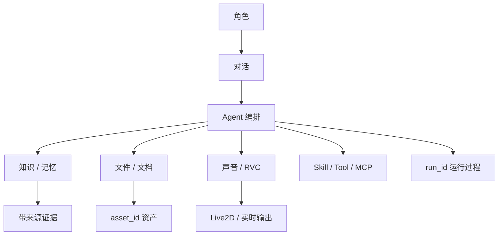

# 能力地图

本页回答“CHARACTOID 当前到底能做什么”。每项能力都对应真实的前端模块、后端路由或运行时组件；需要额外模型或第三方服务的部分会标注依赖。

## 能力分层

| 层 | 能力 | 主要入口 | 状态 |
| --- | --- | --- | --- |
| 交互 | 角色、对话、消息、附件 | Web UI / Desktop | 稳定 |
| 编排 | Supervisor、Worker、Run | Agent API / Runtime | 稳定 |
| 知识 | 文档、RAG、记忆、结构化查询 | 知识页 / 对话 | 可选 |
| 声音 | ASR、TTS、GPT-SoVITS、RVC | 设置 / Voice Studio | 可选 |
| 表现 | Live2D、实时语音 | 对话页 / WebSocket | 实验 / 可选 |
| 扩展 | Skill、Tool、MCP | 扩展页 | 稳定 / 外部依赖 |
| 接入 | B站、OneBot11 | 集成页 / WebSocket | 外部依赖 |
| 质量 | 评测数据集、运行历史、导出 | 评测页 | 可选 |

## 能力之间如何连接

## 选择入口的经验

- 想让系统完成一个目标：优先从对话页开始。
- 想看资源是否就绪：进入设置或系统资源页。
- 想批量处理文件：使用附件、文档或 RVC 任务接口。
- 想安装能力：使用 Skill / MCP / Provider 管理。
- 想集成外部客户端：从 API、事件和 WebSocket 参考开始。

## 不应混淆的概念

- **角色不是模型**：角色保存身份、策略和能力绑定，模型只是其中一个 Provider。
- **Worker 不是聊天机器人**：Worker 执行领域动作，最终可见回复仍由 Supervisor 组织。
- **RAG 不是把所有文档塞进 Prompt**：它是带来源、重排和质量门的检索管线。
- **Run 不是单个 HTTP 请求**：一个 Run 可以包含多个 Worker、等待输入、事件和资产。
- **外部集成不是默认能力**：B站、OneBot、MCP 等需要自己的地址、凭据和生命周期。
