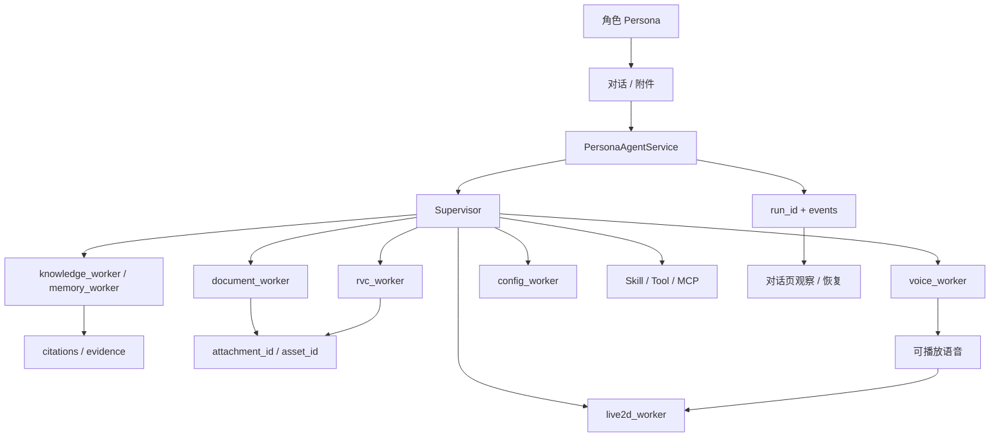

# 能力地图

**本页回答「CHARACTOID 当前到底能做什么」。每一项都对应真实的前端模块、FastAPI 路由或 Runtime 组件；需要额外模型、设备或第三方服务的部分会单独标明。它不是产品宣传清单，而是一张对着源码读的能力图。**

源码入口：`app/startup/routes.py` 的 `_ALL_ROUTERS`、`agents/registry.py` 的 Worker / ToolSpec、`agents/runtime/models.py` 的 Run 状态、`frontend/` 工作台页面。

## 先记住三条边界

1. **角色不是模型。** 角色保存身份、策略、知识空间、声音绑定和能力授权。语言模型只是其中一个 Provider。
2. **Worker 不是聊天机器人。** Worker 执行领域动作，最终对用户可见的回复由 Supervisor 组织。
3. **一次对话任务可以比一次 HTTP 请求长得多。** Run 可以排队、运行、等待确认、暂停、完成、失败或取消；文件和音频用 `asset_id` / `attachment_id` 引用，不把本机绝对路径交给模型。

## 能力分层

| 层 | 能力 | 主要入口 | 关键源码 | 状态 |
| --- | --- | --- | --- | --- |
| 交互 | 角色、对话、消息、附件 | Web UI / Desktop | `frontend/`、`app/routers/personas.py`、`app/routers/attachments.py` | 稳定 |
| 编排 | Supervisor、Worker、Run | Agent API / Runtime | `agents/`、`app/routers/agents.py`、`app/routers/runs.py` | 稳定 |
| 知识 | 文档、RAG、记忆、结构化查询 | 知识页 / 对话 | `rag/`、`ingestion/`、`app/routers/rag.py` | 可选 |
| 声音 | ASR、TTS、GPT-SoVITS、RVC | 设置 / Voice Studio | `voice/`、`app/routers/voice*.py` | 可选 |
| 表现 | Live2D、口型、实时语音 | 对话页 / WebSocket | `live/`、`app/routers/live2d.py`、`app/routers/realtime.py` | 实验 / 可选 |
| 扩展 | Skill、Tool、MCP | 扩展页 | `skills/`、`extensions/`、`app/routers/mcp.py` | 稳定 / 外部依赖 |
| 接入 | B站、OneBot11 | 集成页 / WebSocket | `integrations/`、`app/routers/integrations.py` | 外部依赖 |
| 质量 | 评测数据集、运行历史、导出 | 评测页 | `app/routers/eval.py`、`app/run_store.py` | 可选 |
| 资源 | Provider 安装、模型目录、状态 | 设置 / 资源页 | `app/routers/resources.py`、`app/routers/providers.py` | 可选 |

「可选」不是「没做完」，而是「缺模型或服务时，基础文字对话仍应能用」。GPT-SoVITS、RVC、ASR、Embedding、Reranker、Live2D 都属于这一类。

## 能力之间如何连接



用户在对话页说一句话时，真正发生的是：

```text
frontend 发到 /api/personas/{id}/agent/stream
  → agents/service.py 打开或恢复 Session
  → LangGraph：Supervisor 判断能否直接答，或 delegate_to_* 
  → 对应 Worker 只拿到自己的工具子集
  → 写数据或不可逆操作走 HITL（requires_confirmation）
  → Worker 按合同返回 answer / evidence / artifacts / uncertainties
  → Supervisor 组织对用户的回复
  → Runtime 把状态和事件落到 run_store
  → 前端用 run_id 订阅进度、确认、取消或恢复
```

## Worker 默认执行合同

这些数字来自 `agents/registry.py` 的 `_WORKER_EXECUTION_DEFAULTS`，不是建议值，是当前代码的默认超时和重试。

| Worker | 超时 | 重试 | 主要职责 |
| --- | --- | --- | --- |
| `knowledge_worker` | 45s | 2 次，backoff 0.5s | 角色知识检索、结构化查询、必要时的公开检索 |
| `memory_worker` | 30s | 1 次 | 角色记忆与工作区记忆 |
| `document_worker` | 120s | 2 次，backoff 1s | 文档列表、入库、删除、URL 导入 |
| `profile_worker` | 30s | 1 次 | 改名、更新人设、导出对话 |
| `voice_worker` | 300s | 1 次 | 音色资产、训练、合成、Studio 会话 |
| `rvc_worker` | 1800s | 1 次 | 音视频变声长任务 |
| `live2d_worker` | 45s | 1 次 | 扫描模型、读 VTS 配置、打开模型目录 |
| `config_worker` | 45s | 1 次 | 配置查询、资源安装、应用配置变更 |

Worker 的输入合同目前很窄：`{"request": string}`。输出合同则固定包含 `worker`、`status`、`answer`、`evidence`、`artifacts`、`uncertainties`、`citations`、`trace`、`requires_approval`、`error`。Supervisor 依赖这张表，而不是解析自由文本。

## 选择入口的经验

- **想让系统完成一个目标**：从对话页开始，不要先找「RVC 页面」或「知识页面」绕过 Supervisor。
- **想看资源是否就绪**：设置页 / 系统诊断。`GET /api/system/diagnostics` 只读，不改用户数据。
- **想处理文件**：先上传附件拿到 `file_id`，再 `send-to-rvc` 或 `send-to-rag`，不要让模型看见磁盘路径。
- **想安装能力**：Skill / MCP / Provider。安装是受管任务，有 task_id，可取消、可重试。
- **想接外部客户端**：先读事件、Run 状态和 WebSocket，再写自己的机器人。QQ 和 B站走的是同一条角色任务，不是另一套人设。

## 不应混淆的概念

- **RAG 不是把所有文档塞进 Prompt。** 它是切分、向量检索、重排、引用和质量门。证据不足时应该拒答或请求确认，而不是编造。
- **Run 不是单个 HTTP 请求。** `queued → running → waiting_approval / paused → completed / failed / cancelled`。终态不能再转出，除非幂等写自身。
- **Handoff 不是脚本。** `agents/runtime/models.py` 禁止交接载荷出现 `path`、`command`、`python`、`shell` 字段。Core / Supervisor / Worker 之间只传数据引用和编排元数据。
- **GPT-SoVITS 不是 RVC。** 前者是角色开口；后者是把已有音视频变成另一个音色文件。超时分别是 300s 和 1800s。
- **MCP 工具不属于某个领域 Worker。** `tools_for_specialist("mcp")` 单独取子集，避免 MCP 被误挂到 knowledge_worker 上越权。
- **外部集成不是默认能力。** B站、OneBot、MCP、VTS 都要自己的地址、凭据和生命周期。未配置时应显示真实状态。

## 和展示站的对应关系

落地页把同一条能力链拆成可见的章节，方便非开发者建立心智模型：

| 展示站章节 | 文档应对 |
| --- | --- |
| 工作台 | [角色与对话](/capabilities/persona-chat)、[创建第一个角色](/guide/character) |
| 案例：从一句话到一个结果 | [文件与任务](/capabilities/files-runtime)、[语音链路](/capabilities/voice) |
| 系统：监督者编排 | [系统架构](/concepts/architecture)、[Agent 与 Worker](/development/agent-worker) |
| 接入：QQ / 直播 | [Live2D 与外部接入](/capabilities/live2d-integrations) |
| 资源卡片 | [评测与系统资源](/capabilities/evaluation-resources)、[准备本地资源](/guide/resources) |

## 下一步

- 想按功能深入：[角色与对话](/capabilities/persona-chat) → [知识库与记忆](/capabilities/knowledge-memory) → [文件与任务](/capabilities/files-runtime) → [语音链路](/capabilities/voice)
- 想按源码深入：[源码地图](/concepts/source-map) → [内置 Runtime](/concepts/runtime) → [持久化](/concepts/persistence)
- 想查接口：[API 总览](/reference/api) → [全量路由清单](/reference/api-all)
