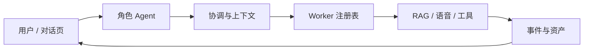

# 系统架构

YUMENO 将一次请求拆成可观察的运行过程：

## 分层职责

- **角色层**：决定身份、语气、知识和声音；
- **协调层**：解析请求、选择 Worker、维护确认与重试；
- **执行层**：访问模型、文件、RVC、GPT-SoVITS、MCP 或其他工具；
- **持久化层**：记录 `run_id`、状态事件、日志和 `asset_id`。

前端不应直接暴露本地路径、Shell 或模型内部参数，而应提交结构化操作。
