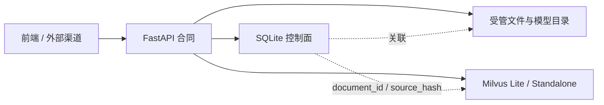

# 数据、资产与安全边界

CHARACTOID 把“谁可以做什么”“任务做到哪一步”“文件结果在哪里”分开处理。这样做的目的不是增加概念，而是避免一次 Agent 调用同时携带角色权限、数据库操作和本地路径，导致难以恢复或审计。

## 三类数据面



| 数据面 | 当前存放内容 | 典型模块 |
| --- | --- | --- |
| SQLite 控制面 | 角色、角色版本、能力策略、记忆、会话消息、附件元数据、VoiceAsset、文档任务、运行任务与步骤 | `app/models.py`、`app/run_store.py` |
| 向量数据面 | 文档内容的 Dense/BM25 索引和检索元数据 | `ingestion/milvus_store.py`、`rag/retriever.py` |
| 文件数据面 | 上传附件、音频、训练/推理结果、受管模型和运行时 | `app/routers/attachments.py`、`voice/`、资源管理器 |

SQLite 与 Milvus 不是同一份数据：SQLite 记录“这个资料和哪个角色、工作区、任务相关”，Milvus 保存“用于检索的向量和稀疏索引”。文件结果通过数据库元数据和 `asset_id` / `file_id` 与任务关联。

## 作用域隔离

主要作用域字段包括：

- `workspace_id`：工作区边界；
- `persona_id`：角色边界；
- `knowledge_space_id`：知识空间边界；
- `document_id`：文档身份；
- `source_hash`：文档去重和增量处理依据；
- `conversation_id`：会话边界；
- `run_id`、`task_id`、`step_id`：运行过程边界。

知识检索会在向量检索时附带作用域过滤，结构化数据查询也不能由用户输入绕过当前角色和工作区约束。

## 文件引用原则

浏览器端只提交和接收结构化引用，不直接提交任意本地绝对路径：

```json
{
  "conversation_id": "conversation_01",
  "attachment_id": "attachment_01",
  "run_id": "run_01",
  "asset_id": "asset_01"
}
```

`attachment_id` 表示用户已上传或已登记的输入；`asset_id` 表示任务生成的音频等结果。服务端根据当前会话、角色和工作区重新解析引用，不能只相信客户端传来的名称。

## 交接合同的限制

`agents/contracts.py` 对 Worker 交接载荷做递归 JSON 校验，并拒绝结构化字段：

```text
path
command
python
shell
```

这项规则的含义是：用户可以在自然语言里讨论“命令”或“路径”，但 Agent 层之间不能把它们作为可执行字段传递。真正的文件处理由受管 Tool、资源目录和服务端适配器完成。

## 能力授权

`agents/capabilities.py` 中的 `CapabilityDescriptor` 描述能力来源、所属 Worker、是否修改数据和是否需要确认；`CapabilityPolicy` 保存角色级覆盖策略。解析顺序支持角色精确匹配、角色通配和全局通配。

MCP 能力默认更谨慎：除非明确确认只读，否则 `CapabilityDescriptor.confirmation_required` 会要求人工确认。角色能力配置与 MCP 连接配置分开存储，避免“连接成功”被误解为“所有角色都可以使用”。

## 可公开事件

`agents/observability.py` 的 `RunRecorder` 会只保留适合展示的摘要，例如节点名、阶段、数量、耗时和状态；不会把 Prompt、Token、密钥、原始工具载荷或模型思维过程写入公开事件。

```json
{
  "sequence": 3,
  "category": "tool",
  "name": "knowledge_retrieve",
  "label": "检索知识",
  "status": "completed",
  "duration_ms": 142.5,
  "details": {"document_count": 4, "confidence": 0.84}
}
```

## 资源管理边界

`config_worker` 只管理应用受管资源，例如 FFmpeg、ASR、Embedding、Reranker、Separator、RVC 和 GPT-SoVITS 运行环境。它不负责删除用户音色模型、会话附件、历史任务结果、知识文档或任意外部路径。

## 本地优先的实际含义

- 默认 FastAPI 绑定 `127.0.0.1`，默认端口为 `18000`；
- 默认向量库使用 Milvus Lite 文件；
- 角色、会话和运行数据使用本地 SQLite；
- LLM、联网搜索、GPT-SoVITS、VTube Studio 等仍可能把数据发送给外部服务，是否发送由对应配置和调用路径决定；
- `.env`、Token、API Key、私有音频和私有文档不能提交到 Git。

“本地优先”不是“所有处理永远不出本机”，而是默认把控制面和主要资源放在本地，并将外部调用拆成可配置适配器。

## 相关源码

```text
app/models.py                    SQLite 实体
app/run_store.py                 运行任务与事件摘要
agents/contracts.py              交接/结果合同与字段安全检查
agents/capabilities.py           能力目录与策略判定
agents/mcp_grants.py             MCP 授权
agents/observability.py          公开事件与运行指标
ingestion/milvus_store.py        向量库适配与作用域过滤
app/routers/attachments.py       附件引用
```
