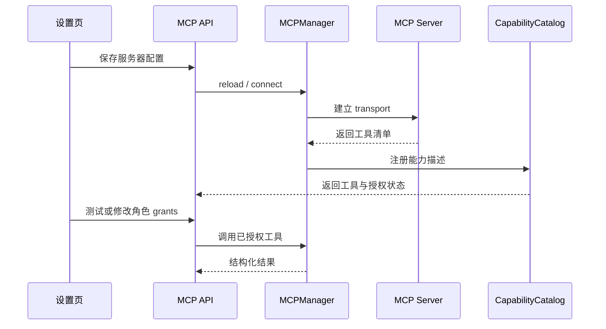

# Skill、Tool 与 MCP 扩展体系

**CHARACTOID 的扩展不是“给模型一段任意代码”。当前实现把**描述、授权、可见性和执行**拆开，便于限制副作用并让角色只看到被允许的能力。**

## 三个概念

| 概念 | 作用 | 当前来源 |
| --- | --- | --- |
| Tool | 具体执行入口，包含输入 schema 和执行函数 | `agents/registry.py`、`agents/tools/` |
| Skill | 提示词指令包，可声明要引用的 Tool | `agents/skills.py`、`agents/skill_parser.py` |
| MCP | 外部服务器提供的 Tool，通过统一协议发现和调用 | `integrations/mcp/` |

## Tool 注册

`ToolSpec` 是内置 Tool 的注册元数据：

```python
@dataclass(frozen=True)
class ToolSpec:
    name: str
    specialist: str
    tool: BaseTool
    requires_confirmation: bool = False
    mutates_data: bool = False
    server: str = ""
```

最小注册示例（用于理解元数据结构，真实项目应复用现有工具函数）：

```python
ToolSpec(
    name="search_persona_knowledge",
    specialist="knowledge_worker",
    tool=search_persona_knowledge,
    requires_confirmation=False,
    mutates_data=False,
)
```

`specialist` 决定工具挂到哪个 Worker；`mutates_data` 表示是否修改数据；`requires_confirmation` 表示执行前是否需要人工确认。二者是正交字段：有的动作写数据但由更上层统一确认，有的动作不写数据却本身就是确认步骤。

## Skill 文件

Skill 由名称、描述、提示词正文和 Tool 名称组成。内置 Skill 位于 `agents/skills/`；用户 Skill 位于 `data/skills/`，可通过 API 管理。

```json
{
  "name": "document-review",
  "description": "帮助角色审阅项目文档",
  "instructions": "先引用原文，再指出风险和缺失信息。",
  "prompt_hint": "文档审阅",
  "tool_names": ["search_persona_knowledge"],
  "enabled": true
}
```

Skill 的 Tool 名称必须引用已注册的 `ToolSpec.name`。加载 Skill 后：

1. 提示词正文进入 Supervisor 的系统上下文；
2. 被声明的 Tool 才对模型可见；
3. 用户 Skill 默认需要显式角色授权；
4. 脚本、信任和启用状态独立管理，不因为上传成功就自动执行脚本。

## Skill API

```text
GET  /api/skills
GET  /api/skills/tools
POST /api/skills
PATCH /api/skills/{name}
DELETE /api/skills/{name}
POST /api/skills/upload
```

内置 Skill 受保护，不能通过删除接口移除。上传的 zip 有大小、文件数和解压大小限制，避免把扩展安装变成任意文件写入入口。

## MCP 配置

MCP 服务器配置使用 `MCPServerConfig`：

```json
{
  "mcpServers": {
    "local-tools": {
      "transport": "stdio",
      "command": "python",
      "args": ["server.py"],
      "env": {},
      "enabled": true,
      "description": "本地只读工具"
    }
  }
}
```

当前支持的 transport：

- `stdio`：本地进程；
- `sse`：远程 SSE；
- `streamable_http`：远程可流式 HTTP。

`stdio` 会经过安全校验；远程 transport 必须填写 `url`。服务器配置默认不预置搜索服务，应用不会因为首次启动就自动连接未知外部服务。

## MCP 生命周期



## MCP 授权与确认

`CapabilityDescriptor` 中的 MCP 元数据被视为不可信。除非服务器明确说明某项操作只读，否则该能力默认需要确认；角色授权通过 `persona_id` 与 capability id 管理。

相关接口：

```text
GET   /api/mcp/servers
POST  /api/mcp/servers
DELETE /api/mcp/servers/{name}
POST  /api/mcp/servers/{name}/enable
POST  /api/mcp/servers/{name}/disable
POST  /api/mcp/servers/{name}/reload
POST  /api/mcp/servers/{name}/test
PATCH /api/mcp/servers/{name}/grants
GET   /api/mcp/tools
```

## 接入检查清单

- 工具名称稳定且符合命名规则；
- 输入 schema 拒绝多余字段；
- 明确读操作和写操作；
- 写操作提供可展示的确认说明；
- 不把 API Key 写入仓库或 Skill 文件；
- 不让工具接收任意 `path`、`shell` 或命令载荷；
- 测试失败时返回“未连接/未授权/服务不可用”，不要伪装成工具执行成功；
- 给角色授权前先确认工具所属 server 和副作用。

## 相关源码

```text
agents/registry.py              ToolSpec 与 Worker 工具分配
agents/skills.py                Skill 扫描、启停、信任和工具引用
agents/skill_parser.py          Skill 目录解析
agents/capabilities.py          能力描述与策略判断
agents/mcp_grants.py            角色级 MCP 授权
integrations/mcp/config.py      MCP 配置、transport 和安全校验
integrations/mcp/client.py      MCP 连接、工具发现和运行时
app/routers/skills.py           Skill API
app/routers/mcp.py              MCP API
```

## 源码合同（中档补全）

扩展不是「装上就对所有角色生效」。授权落在两处，而且必须一致：

1. MCP 服务器 `allowed_persona_ids`（可含 `*`）
2. CapabilityPolicy 的 `mcp/{server}/*` override

角色页 `PUT /api/personas/{persona_id}/mcp-grants` 只改该角色是否出现在名单里；服务器若已经是 `*`，这个 PUT **不会**把全局授权改成私有授权。全局 MCP 只应留给平台级工具。

能力页 `PATCH /api/capabilities/assignments` 通过 `next_allowed_persona_ids` 计算下一份名单，再 `sync_mcp_wildcard_policy`。不要在文档里教「先 `*` 再给某个角色单独关」——实现会把 `*` 展开成其余角色，而不是保留全局减员。

排查顺序不变：enabled → 工具是否出现在 `tool_specs()` → 角色 grants → Run 事件里的确认/超时 → 最后才看 MCP 进程日志。`requires_confirmation` 为真时 Run 进 `waiting_approval`，用户会觉得「没反应」，其实是停在审批。


Skill 与 MCP 都先注册、再按角色授权。全局 `*` 表示「当前这台机器上的平台级工具」，不是「以后创建的角色也永久开放」——取消某个角色上的 `*` 时，实现会展开成其余已知角色，新角色默认关。

演示 Token 只能当占位。写操作、外部发信、改数据的 MCP 工具必须确认。不要在 UI 或日志里展开环境变量里的密钥。断开渠道时清会话，不要留半截 Run 以为渠道自己会收尾。


`GET /api/skills/tools` 列出可供勾选的 ToolSpec，不含尚未连接成功的 MCP 工具。先看清单，再看角色 grants，避免「插件页显示已安装但对话里选不到」。

stdio 传输会拉起外部进程；停用服务器后应确认进程已退出，不要只改 enabled 标志。
