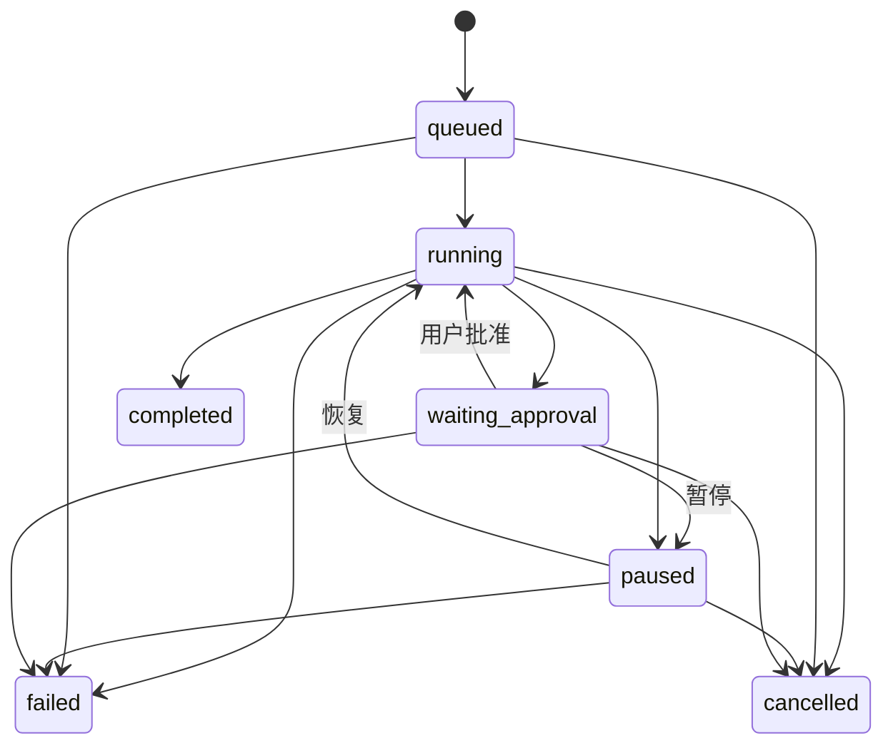
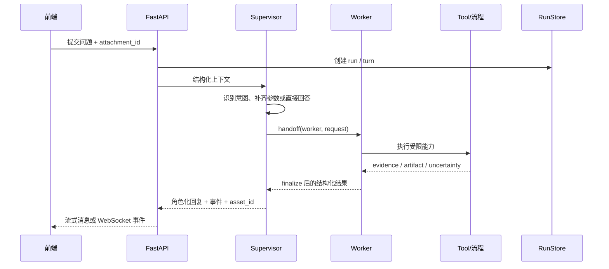
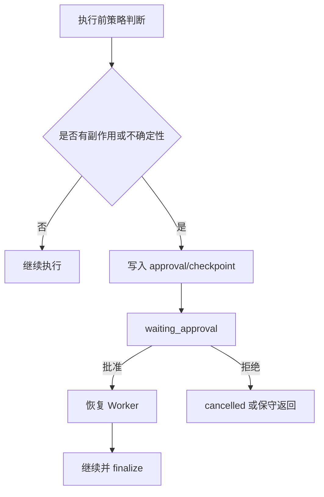

# Agent 生命周期与运行时

**一次请求不是“调用模型并返回字符串”，而是一个带状态、事件、交接和结果引用的运行过程。**

## 生命周期



`agents/runtime/models.py` 中定义的 Run/Task 状态包括：

- `queued`：已经创建但尚未开始；
- `running`：正在执行 Agent、Worker 或外部任务；
- `waiting_approval`：等待用户批准写操作、联网或下一步；
- `paused`：被运行时暂停，保留恢复所需信息；
- `completed`：成功终态；
- `failed`：失败终态；
- `cancelled`：取消终态。

终态不会再转移到其它状态；相同终态允许幂等更新。

## 一次对话的过程



### 交接合同

`agents/contracts.py` 的交接数据只允许 JSON 可序列化值，并明确拒绝结构化字段 `path`、`command`、`python`、`shell`。这不是禁止用户在普通文本里提到这些词，而是禁止把它们作为可执行载荷字段传递给下一层。

一个可复制的最小结果形状如下：

```json
{
  "worker": "rvc_worker",
  "status": "completed",
  "answer": "变声音频已生成",
  "evidence": [],
  "artifacts": [
    {"asset_id": "asset_01", "kind": "audio", "name": "output.wav"}
  ],
  "uncertainties": [],
  "citations": [],
  "trace": [{"stage": "convert", "status": "completed"}],
  "requires_approval": false,
  "error": null
}
```

## 事件与可观测性

`agents/observability.py` 的 `RunRecorder` 是请求级遥测对象，记录：

- `run_id`、来源和状态；
- 模型调用次数和耗时；
- 首 token 时间；
- handoff 数量；
- Tool 事件成功/失败；
- 上下文压缩前后的统计；
- 对前端安全的事件摘要。

记录器会清理事件详情，不把 Prompt、密钥、原始工具载荷或思维过程写进公开事件。运行 API 还可通过 `/api/runs/{run_id}` 和 `/api/runs/{run_id}/events` 查询状态与事件。

## 人工确认与恢复



适合进入确认的动作包括：

- 修改角色、记忆、文档或设置；
- 清理受管资源；
- 证据不足时的联网回退；
- 需要用户选择下一步的文件或声音处理；
- 由外部 MCP 声明但尚未证明为只读的工具。

## 失败、重试和取消

- Worker 的默认重试和退避由 `WorkerRetryPolicy` 管理，不同领域使用不同超时。
- 失败必须返回可展示的错误和阶段，而不是把 Python traceback 直接交给用户。
- 运行时取消会触发注册的 cancel handler；RVC 任务还会终止受管推理进程。
- 事件应保持幂等可读；前端断线后可以重新读取 run 和 events，而不依赖页面内存。

## 前端接入示例

```js
const run = await fetch(`/api/runs/${runId}`).then((r) => r.json())
const events = await fetch(`/api/runs/${runId}/events`).then((r) => r.json())

if (run.status === 'waiting_approval') {
  await fetch(`/api/runs/${runId}/approval`, {
    method: 'POST',
    headers: {'Content-Type': 'application/json'},
    body: JSON.stringify({approved: true})
  })
}
```

## 相关源码

```text
agents/runtime/models.py       状态、任务、步骤、事件模型
agents/runtime/runner.py       运行控制、取消处理
agents/runtime/native.py       Native Runtime 会话和 Job
agents/contracts.py            handoff / result 合同
agents/checkpoint.py           checkpoint 接口
agents/observability.py        RunRecorder 与安全事件
app/run_store.py               应用层运行记录
app/routers/runs.py            Run 查询、取消和 approval API
```

## 状态机与存储的真实边界

上面的 mermaid 是产品语义。落地时有三层，不要当成同一个对象：

1. **`RunStatus`**（`agents/runtime/models.py`）驱动 `RunStore.update_status`。终态到自身是幂等；终态到其它状态非法。
2. **`TaskStatus`** 注释写明：Phase 1 **只定义合同，不驱动状态转换**。不要假设改 task 行就能推动 Agent。
3. **`StepStatus`** 比 run 多一个 `skipped`，给编排器跳过的步骤，不是给用户点的取消。

`create_run_with_task` 是新托管任务的原子入口：同一 session 里写入 run、primary task、initial step、可选首事件。`task.run_id`、`step.task_id`、`event.run_id` 对不上会 `INVALID_REQUEST`，避免 UI 先看到 running run、child 记录还不存在。

进程重启时 `recover_incomplete_runs()` 只收口 `queued` 和 `running` 为 `failed`（`runtime_restarted`）。`waiting_approval` / `paused` 会留下，因为它们等的是用户，不是已死掉的本进程执行者。

公开事件的 `details` 在 `RunEvent` 校验期就走白名单；`resume_state` 写入 `update_status` 时也会再洗一遍。Prompt、密钥、绝对路径、工具原始载荷不会出现在 `/api/runs/{id}/events`。

进度字段 `progress` / `total` 不能为负。事件 `sequence` 从 1 起算，增量拉取用 `sequence > after_sequence`。

前端刷新后要靠同一个 `run_id` 把时间线补齐：`GET /api/runs/{id}` + `GET /api/runs/{id}/events?after_sequence=`。不要把“页面还在转圈”当成状态。

## 源码合同（中档补全）

任务状态由 Runtime 持有，不由前端页面持有。用户可见的停顿经常是 `waiting_approval`，不是失败。

超时边界（秒）：profile 30、memory 30、knowledge 45、live2d 45、config 45、document 120、voice 300、rvc 1800。knowledge / document 另有有限重试；voice / rvc 不靠短超时重试，因为转换本身就长。

取消走 `POST /api/runs/{id}/cancel` 或 SSE 断线时的 `realtime_executions.cancel(persona_id:conversation_id)`。拒绝审批等于 cancel，没有第四种「rejected」终态。恢复用 resume 接口，不要重放用户原句。
