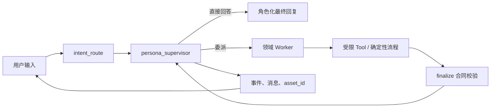

# CHARACTOID 是什么

**CHARACTOID 是一个**本地优先、角色驱动、可恢复执行的 Agent 工作台**。它不是把聊天、知识库、音频和 Live2D 拼在一起的页面集合，而是把这些能力放进同一个可追踪的运行模型：一次请求有明确的入口、路由、Worker、工具、状态事件、结果资产和最终回复。**

> **事实依据**：仓库根目录 `ARCHITECTURE.md`、`agents/graph/`、`agents/registry.py`、`agents/runtime/`、`app/routers/`、`voice/`、`rag/`。

## 核心闭环

核心原则是：

1. **Supervisor 是唯一的对外表达出口**：Worker 返回结构化结果，不直接模拟角色与用户对话。
2. **模型负责选择，代码负责执行**：需要访问知识库、SQL、文件或外部服务时，执行路径由确定性代码约束。
3. **输入和结果使用引用**：附件、任务和音频结果通过 `attachment_id`、`run_id`、`asset_id` 关联，浏览器不接触本地绝对路径。
4. **可暂停、可确认、可恢复**：写操作、联网回退和资源变更可以进入人工确认或 checkpoint。
5. **能力可以按角色授权**：内置 Tool、Skill 和 MCP 能力都要经过注册、作用域和授权，而不是把所有工具塞给每个角色。

## 能力分级

| 等级 | 含义 | 当前例子 |
| --- | --- | --- |
| 稳定 | 已有明确源码入口、路由或测试覆盖 | 角色管理、Agent 对话、运行状态、RAG 主链路、附件管理 |
| 可选 | 代码已接入，但需要本地模型、运行时或配置 | Embedding、Reranker、ASR、GPT-SoVITS、RVC、Separator |
| 实验 | 已有接入边界或接口，使用前需要目标环境验证 | Live2D/VTube Studio、实时语音、部分外部渠道 |
| 外部依赖 | CHARACTOID 只负责适配，实际能力由第三方服务提供 | LLM Provider、Milvus Standalone、GPT-SoVITS、FFmpeg、VTube Studio |

分级描述的是**项目当前代码状态**，不是对第三方项目质量或许可证的评价。

## 阅读路径

- 想先理解整体：阅读[系统架构](./architecture.md)与[数据和安全边界](./data-boundaries.md)。
- 想跟一次请求：阅读[Agent 生命周期](./lifecycle.md)。
- 想学习知识问答：阅读[RAG 设计](./rag.md)。
- 想理解音频到角色表现：阅读[声音与 Live2D](./voice-live2d.md)。
- 想扩展能力：阅读[Skill、Tool 与 MCP](./extensions.md)。
- 想了解系统的工程取舍：阅读[工程实践](/development/engineering)。
