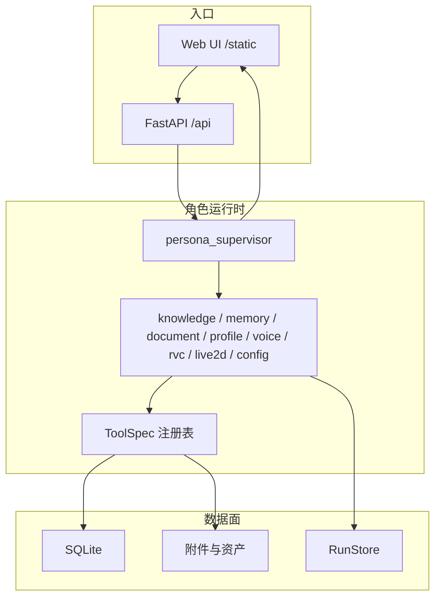

# CHARACTOID 是什么

**CHARACTOID 是一个本地优先、角色驱动、可恢复执行的 Agent 工作台。** 它不是把聊天、知识库、音频和 Live2D 拼在一起的页面集合，而是把这些能力放进同一个可追踪的运行模型：一次请求有明确的入口、路由、Worker、工具、状态事件、结果资产和最终回复。

> **事实依据**：`app/main.py`、`app/startup/routes.py`、`agents/graph/`、`agents/registry.py`、`agents/runtime/`、`app/routers/`、`voice/`、`rag/`。

## 一句话模型

用户永远对着**某个角色**说话。角色带着自己的人设、知识、记忆、声音、形象和授权能力。监督者（`persona_supervisor`）是唯一对用户开口的出口；领域 Worker 只返回结构化结果，不直接扮演角色。

## 五个核心原则

1. **Supervisor 是唯一的对外表达出口**。Worker 必须交出符合 `_WORKER_OUTPUT_SCHEMA` 的结果：`worker, status, answer, evidence, artifacts, uncertainties, citations, trace, requires_approval, error`。监督者再组织成角色口吻。
2. **模型负责选择，代码负责执行**。需要访问知识库、SQL、文件或外部服务时，执行路径由 `agents/tools/*` 的确定性代码约束，而不是让模型自由调任意系统命令。
3. **输入和结果使用引用**。附件、任务和音频结果通过 `attachment_id`、`run_id`、`asset_id`、`session_id`、`task_id` 关联。浏览器拿不到本地绝对路径。
4. **可暂停、可确认、可恢复**。写操作、联网回退和资源变更可以进入人工确认（HITL）或 checkpoint。运行可用 `POST /api/runs/{id}/cancel` 取消，`POST /api/runs/{id}/approval` 审批。
5. **能力按角色授权**。内置 Tool、Skill 和 MCP 都要经过注册、作用域和授权；不是把全部工具塞给每个角色。角色能力见 `GET/PUT /api/personas/{id}/capabilities`，MCP 授权见 `GET/PUT /api/personas/{id}/mcp-grants`。

## 运行入口

应用工厂在 `app/main.py:create_app()`，路由注册在 `app/startup/routes.py:register_routes`。

默认端口 **18000**。根路径 `/` 重定向到 `/static/index.html`。

内建系统接口（直接写在 `register_routes`，不属于某个业务 router）：

| 方法 | 路径 | 作用 |
| --- | --- | --- |
| GET | `/api/health` | `{"status":"ok","workspace_id":...}` |
| GET | `/api/status` | `ingestion.status.get_system_status()` |
| GET | `/api/launcher/progress` | 启动器进度；未注入时返回空步骤 |

静态资源：

- `/static` → Web 工作台
- `/live2d-assets` → `data/live2d`
- `/sqlite` → 可选 Datasette 挂载（依赖安装失败时静默跳过）

## Worker 不是插件口号

`agents/registry.py` 里的规范顺序是固定的：

`knowledge_worker → memory_worker → document_worker → profile_worker → voice_worker → rvc_worker → live2d_worker → config_worker`

超时与重试（秒）：

| Worker | 超时 | 重试 |
| --- | --- | --- |
| knowledge_worker | 45 | 最多 2 次，backoff 0.5s |
| memory_worker | 30 | 1 |
| document_worker | 120 | 最多 2 次，backoff 1s |
| profile_worker | 30 | 1 |
| voice_worker | 300 | 1 |
| rvc_worker | 1800 | 1 |
| live2d_worker | 45 | 1 |
| config_worker | 45 | 1 |

兼容别名（`_WORKER_COMPAT_ALIASES`）仍然认识旧短名：`knowledge`、`memory`、`document`、`profile`、`voice`、`voice_clone`、`live2d`、`rvc`、`config`。新代码应使用 `*_worker` 全名。

清单 HTTP 接口：

- `GET /api/workers/manifests`
- `GET /api/workers/manifests/{worker}`

## 它不是什么

- **不是云端多租户 SaaS**。默认假设本机用户，`require_local` 会拒绝非本机写资源和敏感操作。
- **不是通用操作系统 Agent**。没有任意 shell、没有任意文件系统遍历；工具按 specialist 切片。
- **不是“有页面就等于能力已就绪”**。语音、RVC、Embedding、GPT-SoVITS、Live2D 都是可选资源，`/api/status` 和资源页会显示未就绪。
- **不是 Worker 直接对用户说话的系统**。如果某个 Worker 返回了适合展示的 `answer`，仍然由监督者决定如何说。

## 和页面的对应关系

落地页把同一条链拆成几章，只是展示，不是另一套架构：

| 落地页章节 | 对应源码事实 |
| --- | --- |
| 工作台 | 角色是工作台：人设、知识、对话在同一对象上 |
| 案例 | 一句话落到一次真实操作（附件、确认、长任务、结果） |
| 系统 | 监督者编排，Worker 分头执行 |
| 接入 | QQ / 直播等外部通道接到同一角色 |
| 资源 | Worker 依赖可管理资源，而不是凭空推理 |

更细的源码地图见 [源码地图](/concepts/source-map)，模块关系见 [系统架构](/concepts/architecture)，任务状态机见 [任务生命周期](/concepts/lifecycle)。
