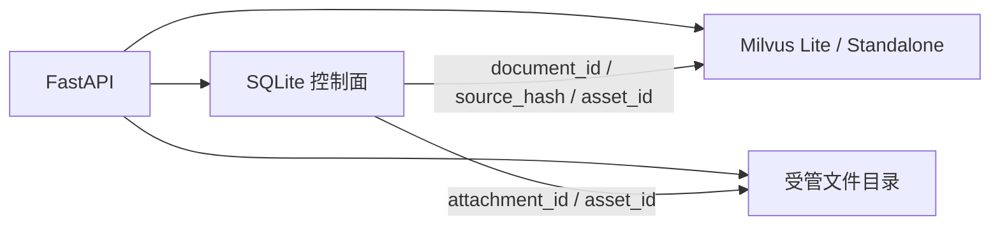

# 持久化目录

**CHARACTOID 把持久化拆成三面：SQLite 控制面、Milvus 检索面、受管文件面。角色“记得什么”、文档“能否被搜到”、音频“文件在哪”不是同一张表里的同一行。**

这对应 DeepSeek Harness 文档里的 persistence-catalog：先列出权威存储，再说明谁允许写、谁只保存引用。

## 三面总览



| 面 | 默认位置 | 权威内容 | 不保存的内容 |
| --- | --- | --- | --- |
| SQLite | `data/charactoid.db` | 角色、版本、策略、消息、记忆、Run、文档任务、音色元数据 | 向量、大音频二进制 |
| Milvus | `data/milvus_local.db` 或远程 URI | Dense / BM25 索引、检索元数据、作用域字段 | 人设全文、密钥 |
| 文件 | 项目内受管目录 | 上传附件、结果音频、本地模型、引擎运行时 | 任意盘符下的用户文件 |

`settings.py` 要求本地 Milvus 文件必须落在项目目录内。不能把 `MILVUS_DB_URI` 指到项目外路径。

## SQLite 实体

`app/models.py` 当前主要实体：

| 实体 | 作用 |
| --- | --- |
| `KnowledgeSpace` | 知识空间 |
| `Persona` | 角色 |
| `PersonaVersion` | 人设版本 |
| `PersonaCapabilityPolicy` | 角色能力覆盖 |
| `PersonaDraft` | 草稿 |
| `PersonaMemory` | 角色记忆 |
| `WorkspaceMemory` | 工作区记忆 |
| `ConversationMessage` | 消息 |
| `ConversationAttachment` | 附件元数据 |
| `ConversationMessageAttachment` | 消息和附件的关联 |
| `VoiceAsset` | 音色资产元数据 |
| `ConversationSummary` | 会话摘要 |
| `DocumentJob` | 文档处理任务 |
| `RagQueryRecord` / `RagQueryFeedback` | 检索记录与反馈 |
| `RagEvaluationRun` / `Case` / `Candidate` | 评测 |
| `ProviderDownloadTask` | 受管资源下载 |
| `AgentRunRecord` / `AgentRunEventRecord` | Run 与事件 |
| `RuntimeTaskRecord` / `RuntimeStepRecord` | Task / Step |

控制面回答的问题是：“这个对象属于谁、进行到哪一步、结果引用是什么”。它不回答“第 3 个 chunk 的 1024 维向量是什么”。

## 检索面

`ingestion/milvus_store.py` 写入向量和稀疏索引。检索时 `rag/retriever.py` 必须带作用域过滤，至少包括工作区和知识空间，避免角色搜到别人的资料。

文档身份对齐靠：

- `document_id`：控制面主键
- `source_hash`：内容去重
- chunk 元数据：标题、相邻块、来源

结构化表不进 Milvus 当“假文本”。CSV/XLSX 进入 SQLite，表结构说明可以进向量库，查询走受限 SQL。

## 文件面

浏览器只传引用：

```json
{
  "attachment_id": "attachment_01",
  "asset_id": "asset_01",
  "run_id": "run_01"
}
```

服务端按当前 `workspace_id` / `persona_id` / `conversation_id` 解析。不要在 Worker 交接里放 `path` 字段。

`config_worker` 管理的是应用受管资源，例如 FFmpeg、ASR、Embedding、Reranker、Separator、RVC、GPT-SoVITS。它不负责删除用户对话附件、历史变声结果或知识文档。

## 设置存在哪

| 来源 | 内容 |
| --- | --- |
| `.env` / `.env.example` | 主机、端口、SQLite 路径、Milvus URI |
| `data/local_settings.json` | 工作台里保存的 LLM、Embedding、搜索等 |
| 角色记录 | 人设、能力策略、绑定的音色和知识空间 |

LLM Key 不进 Git，也不该进公开事件。`settings.py` 会把模板占位 Key 当成未配置。

## 会话检查点

LangGraph checkpointer 按 `thread_id = persona_id:conversation_id` 保存图状态。它和 RunStore 同时存在：

- checkpointer：图能不能从 interrupt 继续
- RunStore：前端能不能画出进度、确认按钮和结果卡

不要只依赖浏览器内存里的最后一帧 WebSocket 消息。

## 备份与迁移时要一起带走的东西

如果只复制数据库文件：

- 角色和对话还在；
- 音频和模型可能丢失；
- 向量索引可能对不上 `document_id`。

最小完整备份应包括：

1. `data/charactoid.db`
2. Milvus Lite 文件或对应远程集合
3. 附件与 `VoiceAsset` 指向的受管文件
4. `data/local_settings.json`（注意其中有密钥，按密钥规范保管）

## 相关源码

```text
settings.py                     路径与 URI 校验
app/models.py                   SQLite 实体
app/database.py                 引擎
app/run_store.py                Run 持久化
ingestion/milvus_store.py       向量写入与过滤
rag/retriever.py                检索
app/attachments.py              附件引用
```

## 控制面之外的硬合同

`settings.py` 里的 `workspace_id` **不是** `.env` 项。当前快照把它写死为 `local-default`。备份、过滤表达式和 Worker 作用域都按这个值走；不要假设改 `.env` 能换工作区。

`Settings.load()` 是不可变 dataclass。`.env` 只合并主机、端口、SQLite、Milvus 和 RAG 控制参数。`data/local_settings.json` 损坏或不是合法 JSON 时，`load()` 把它当成空对象，让设置页仍能打开并改回去，而不是让整个进程起不来。

### 附件文件面

`app/attachments.py`：

- 根目录：`{project_root}/data/attachments/{sha256(conversation_id)[:32]}/`
- 显示名可以改（`apply_display_name`），**存储路径和 kind 不跟着改**
- 读取前必须 `Path.resolve()` 后仍落在该会话的 `attachment_root` 下，否则当 `FileNotFoundError`
- 单文件上限 `MAX_ATTACHMENT_BYTES = 512 * 1024 * 1024`（512MB）。这和 `.env` 的 `MAX_UPLOAD_MB`（默认 50，主要用于文档摄取）不是同一道门
- 扩展名白名单同时覆盖文档、图片、音频、视频；未知后缀不会按 MIME 猜测放行

公开附件对象只返回 `file_id / name / mime_type / kind / size / duration`，不返回磁盘路径。

### 检索面过滤不是加分项

`ingestion/milvus_store.py` 与 `rag/retriever.py` 的过滤表达式在服务端先截断候选，再算相似度：

| 函数 | 表达式 |
| --- | --- |
| `document_filter` | `workspace_id` + `knowledge_space_id` + `document_id` |
| `knowledge_space_filter` | `workspace_id` + `knowledge_space_id` |
| `build_scope_expression` | `workspace_id` + `knowledge_space_id in [...]` + `category == "content"` |

字符串值用 `json.dumps` 做 `quote_filter_value`，避免手工拼接把引号写进 expr。`category == "content"` 用来排除非正文行。

Milvus Lite 的 `.db` 在同一进程内复用 `MilvusClient`；`close_milvus_connections` 在退出时统一释放。多个进程不要抢同一个 Lite 文件，那种部署应改 Standalone。本地 URI 必须落在项目目录内，`normalize_milvus_uri` 会拒绝项目外路径。

写入后 `add_documents` 会显式 `flush`，随后检索才能立刻看见新块。

## 源码合同（中档补全）

LLM 凭据在 `data/local_settings.json`，启动脚本生成的 `.env` 不管 Key。`workspace_id` 固定 `local-default`。Milvus Lite 的 URI 必须落在项目目录内（`normalize_milvus_uri`），远程才允许 `http://` / `https://` / `tcp://` / `unix://`。同一 Lite `.db` 不要跨进程打开。文档向量在 `add_documents` 后应 `flush`，否则刚索引的内容可能查不到。
