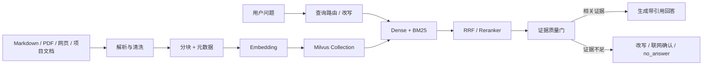
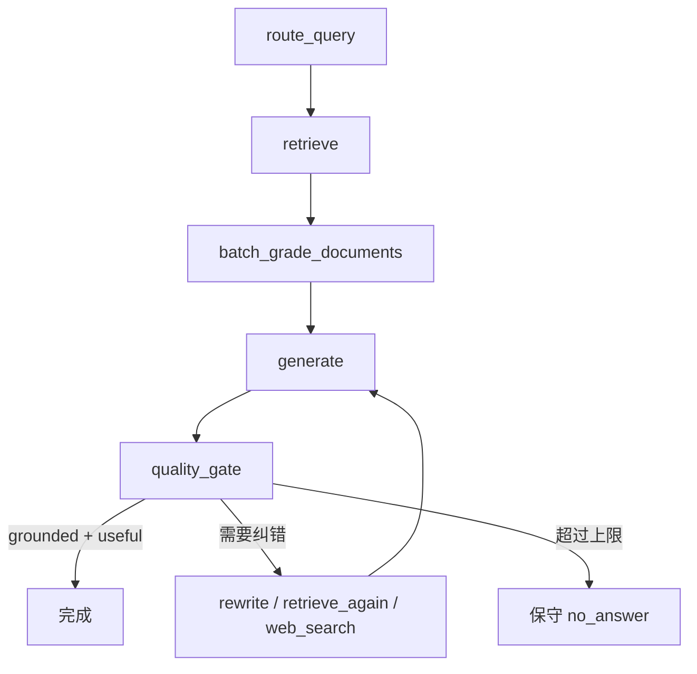

# RAG 与知识资源

**CHARACTOID 的 RAG 是角色 Agent 可以委派的一项知识能力。它的目标不是“把相似文本塞进 Prompt”，而是让回答经过**作用域过滤、候选检索、精排、答案质量门和必要的回退策略**。**

## 端到端流程



## 摄取阶段

当前源码将文档处理和向量索引拆成任务：

1. 接收受管附件或文档任务；
2. 提取文本并保留文件名、标题、章节、来源等元数据；
3. 按内容边界切分；
4. 生成 Embedding；
5. 写入 Milvus；
6. `flush` 后使后续检索可见；
7. 记录 `workspace_id`、`knowledge_space_id`、`document_id`、`source_hash` 等隔离与去重字段。

### 为什么需要新的 Collection 名称

`.env.example` 默认：

```env
MILVUS_DB_URI=./data/milvus_local.db
COLLECTION_NAME=charactoid_knowledge_v1
```

如果更换 Embedding 模型或维度，旧向量通常不能直接复用。正确做法是使用新的 Collection 名称重新导入，而不是让不同维度混在同一索引中。

## 查询阶段

`rag/adaptive_graph.py` 定义 Adaptive/Corrective RAG 主图：



主要控制点：

- **检索前**：根据问题和交互模式决定是否查知识、查结构化数据或请求外部信息；
- **检索中**：先按 workspace/knowledge space 过滤，再进行 Dense 与 BM25 结果融合；
- **检索后**：Reranker 对候选精排，过低相关性会被标为无关；
- **生成后**：检查是否有事实接地（grounded）和是否解决问题（useful）；
- **纠错边界**：查询改写次数、生成重试次数和联网回退都受配置限制；最终可以保守地返回无答案。

## 证据合同

面向 Supervisor 的知识结果应包含：

```json
{
  "status": "completed",
  "answer": "根据已索引资料……",
  "evidence": [
    {
      "source": "architecture.md",
      "section": "系统分层",
      "snippet": "……",
      "score": 0.84
    }
  ],
  "citations": ["document_01#系统分层"],
  "uncertainties": [],
  "confidence": 0.84,
  "used_web_search": false
}
```

证据不足时不能把低质量相似片段伪装成确定答案。可选路径是拒答、请求联网确认，或走受策略控制的网页检索。

## 结构化数据

同一个 knowledge_worker 也可处理只读结构化查询。Planner 产生 SQL 合同，执行器负责作用域、只读检查和结果格式化；Worker 不直接把任意 SQL 字符串交给数据库。CSV/XLSX 等结构化资料使用 SQLite 数据面，知识正文使用 Milvus 检索。

## 配置示例

```env
RAG_PIPELINE=default
MAX_REWRITE_COUNT=1
MAX_GENERATION_RETRY=1
DEFAULT_CONFIDENCE_THRESHOLD=0.75
MAX_UPLOAD_MB=50
```

配置含义：

| 配置 | 作用 |
| --- | --- |
| `RAG_PIPELINE` | 默认启用 Adaptive/Corrective 流程；`adaptive` 是兼容别名 |
| `MAX_REWRITE_COUNT` | 证据不足时最多改写查询的次数 |
| `MAX_GENERATION_RETRY` | 质量门失败后最多重新生成的次数 |
| `DEFAULT_CONFIDENCE_THRESHOLD` | 低于阈值时进入质量检查或纠错路径 |
| `MAX_UPLOAD_MB` | 单文件上传大小限制 |

## 常见 API 与源码入口

```text
POST /api/personas/{persona_id}/rag/query
GET  /api/personas/{persona_id}/rag/queries
POST /api/personas/{persona_id}/rag/queries/{query_id}/feedback
GET  /api/personas/{persona_id}/rag/report
GET  /api/documents/{job_id}
POST /api/documents/{job_id}/confirm
POST /api/documents/{job_id}/retry-index
```

```text
rag/adaptive_graph.py       Adaptive/Corrective RAG 状态机
rag/retriever.py            检索器与作用域过滤
rag/reranker.py             候选精排
rag/graders.py              文档与答案质量门
rag/query_rewriter.py       查询改写
rag/context_assembler.py    上下文装配
ingestion/milvus_store.py   Milvus Lite / Standalone 适配
ingestion/embeddings/       Embedding 管理
```

## RAG 的边界

- 未配置 Embedding/Reranker 时不能宣称完整质量链已启用；代码会按可用能力降级并降低可信度。
- Milvus Lite 适合本地单进程；多进程共享同一个 Lite 文件不是默认目标，生产化部署应使用 Standalone。
- 召回率、延迟和准确率必须用固定题集实测，不能从代码结构推导成宣传数字。

## 检索器合同（源码）

`rag/retriever.py` 的 `build_retriever(context, k=4)` 默认把 **4** 条片段交给评分/生成。调大 `k` 会提高召回上限，同时增加后续 token。`ranker_params.k` 是 RRF 的排名平滑常数，**不是**返回条数。

`score_threshold` 只作用于 Dense 初筛，用来丢掉明显无关的向量命中。RRF 融合之后仍然按 `k` 截断。BM25 一路吃的是 `text` 字段：VARCHAR + jieba（`cnalphanumonly`），由 Milvus 内置 `FunctionType.BM25` 生成稀疏向量。

作用域表达式由 `build_scope_expression` 生成，并作为 Milvus `expr` 下推：

```text
workspace_id == "<workspace>"
and knowledge_space_id in ["...", "..."]
and category == "content"
```

这是强制数据边界，不是相似度加权。角色不能靠“向量更像”跨到别人的知识空间。

`_cached_store` 按连接标识缓存已 `connect()` 的 `MilvusRagStore`（`lru_cache(maxsize=4)`）。缓存键覆盖 URI、集合名、维度等会影响连接的配置；测试替身类与生产类互不污染。`connect()` 里的集合维度校验在缓存后只发生一次。设置变更后应走 `clear_retriever_cache()`，不要假设旧连接还指向新集合。

Embedding 默认来自 `data/local_settings.json`：`managed_local` 默认维度 1024，其它默认 512。维度或模型变了，不要复用旧 Collection 名称。

## 文档进入检索之前

知识文档不是「上传完就能搜」。`ingestion/document_jobs.py` 的状态机：

```text
converting → preview_ready → indexing → indexed
                              ↘ index_failed
```

| 动作 | 合法前置状态 | 非法时 |
| --- | --- | --- |
| 上传并转换 | 新 job，先 `converting` | 扩展名不在白名单、超过 `MAX_UPLOAD_MB` |
| 用户确认索引 `confirm` | 仅 `preview_ready` 且已有 `markdown_path` | `INVALID_DOCUMENT_STATE` |
| 重试索引 `retry-index` | 仅 `index_failed` 且已有 `markdown_path` | `INVALID_DOCUMENT_STATE` |

允许扩展名包括办公文档、html/csv/json/xml/txt/md、epub 和常见图片。`.csv` / `.xlsx` 走结构化导入，写入 schema card，不把表格行直接当成散文切片。

体积边界不要和附件、语音混用：

- 知识文档：`MAX_UPLOAD_MB` 默认 **50**
- 对话附件：`MAX_ATTACHMENT_BYTES` = **512MB**（错误含 `512` → 413）
- 听写空文件才是 422；文档上传没有 `EMPTY_FILE` 码

检索作用域由 `build_scope_expression` 下推到 Milvus `expr`：

```text
workspace_id == "<workspace>"
and knowledge_space_id in ["...", "..."]
and category == "content"
```

角色不能靠「向量更像」跨到别人的知识空间。未 `indexed` 的 job 不应出现在 `knowledge_worker` 的证据里。

对话附件要入库时走 `send-to-rag`，仍然使用 `file_id`，不传本机路径。

