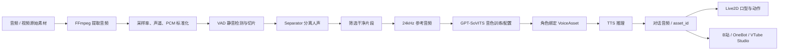

# 声音、RVC、GPT-SoVITS 与 Live2D

**CHARACTOID 的声音能力分为两类：**

- **声音生产链**：从音频/视频素材得到干净参考音频、RVC 变声结果或 GPT-SoVITS 音色资产；
- **声音表现链**：把 TTS/实时语音输出送入对话页、Live2D、VTube Studio 或外部渠道。

其中 GPT-SoVITS、RVC、Separator、FFmpeg、ASR 和 VTube Studio 都是可选或外部依赖，不安装时核心文字 Agent 仍可工作。

## 从视频到实时对话



## Voice Studio 事实链路

`voice/clone_pipeline.py` 的流程是：

1. 视频经 FFmpeg 提取为 44.1kHz、双声道 PCM WAV；
2. 转为适合 VAD 的 16kHz 单声道；
3. 对音频做人声分离；
4. 根据语音活动区间生成片段；
5. 片段转为 24kHz 单声道参考音频；
6. 保存可选择、试听和组合的片段；
7. 完成后交给 GPT-SoVITS 或 VoiceAsset 训练/推理链路。

参考实现中的上限和目标是代码事实，不应理解成所有素材都必须满足的硬性规则：参考音频通常控制在较短时长，训练切片可以保留更长的干净语音集合。

## RVC

RVC 是受管的异步音频转换能力。典型使用方式是：

```text
创建 RVC session
→ 绑定 conversation attachment 或受管文件
→ 提取/标准化来源
→ 可选人声分离
→ 选择模型与 index
→ 提交 convert 任务
→ 轮询 task 状态
→ 获取 WAV 输出
→ 注册结果 attachment/asset
```

相关接口：

```text
POST /api/voice/rvc/sessions
POST /api/voice/rvc/sessions/{session_id}/source
POST /api/voice/rvc/sessions/{session_id}/extract
POST /api/voice/rvc/sessions/{session_id}/separate
GET  /api/voice/rvc/models
POST /api/voice/rvc/convert
GET  /api/voice/rvc/tasks/{task_id}
DELETE /api/voice/rvc/tasks/{task_id}
GET  /api/voice/rvc/tasks/{task_id}/output
```

RVC 任务由 `voice/rvc/sessions.py`、`voice/rvc/tasks.py`、`voice/rvc/adapter.py` 和 `agents/tools/rvc.py` 协作。任务状态包含阶段性进度；真实百分比取决于音频时长、模型和设备，不应当当作精确预测。

## GPT-SoVITS

GPT-SoVITS 适配器负责：

- 检查安装目录、Python 和 API 脚本；
- 启动或停止外部服务；
- 加载 GPT 权重、SoVITS 权重和参考音频；
- 调用 `/tts` 生成 WAV；
- 返回可绑定角色的音频结果。

示意代码：

```python
from voice.gpt_sovits.adapter import GPTSoVITSAdapter

adapter = GPTSoVITSAdapter(config)
wave_bytes = adapter.synthesize(
    "你好，欢迎使用 CHARACTOID。",
    text_lang="zh",
    gpt_weights="models/voice/gpt.ckpt",
    sovits_weights="models/voice/sovits.pth",
    refer_audio="data/voice/reference.wav",
)
```

该代码展示适配器边界；实际应用推荐通过 `voice_assets` / `voice_studio` API 和 `voice_worker` 调用，以获得任务、权限和资产记录。

## 音频资产与角色绑定

`VoiceAsset` 保存音色资源的应用级引用。应用可以创建、导入、更新、删除、训练、合成音频，并把音色绑定到 Persona。结果不应把本地文件路径直接返回前端，而应通过资产接口或 `asset_id` 获取。

常见接口：

```text
GET  /api/voice-assets
POST /api/voice-assets
GET  /api/voice-assets/{asset_id}
POST /api/voice-assets/{asset_id}/synthesize
POST /api/voice-assets/{asset_id}/train
POST /api/voice-assets/train-from-studio
GET  /api/gpt-sovits/status
POST /api/gpt-sovits/service/start
```

## ASR 与实时语音

实时语音 WebSocket 位于 `/api/voice/stream/ws`，当前协议以 16kHz、PCM signed 16-bit 为基础，服务端使用 VAD 切分语音片段并产生部分结果。配置和状态通过 `/api/voice/stream/status` 查询。

TTS 既有普通合成接口，也有流式 HTTP/WebSocket 接口：

```text
GET /api/tts/status
POST /api/tts/personas/{persona_id}/conversations/{conversation_id}/synthesize/stream
WS   /api/tts/personas/{persona_id}/conversations/{conversation_id}/synthesize/ws
```

## Live2D 与 VTube Studio

Live2D 当前 API 主要提供：

```text
GET  /api/live2d/models
GET  /api/live2d/vts
POST /api/live2d/model-directory
```

`/api/live2d/vts` 返回本地 VTube Studio Public API 配置（默认主机 `127.0.0.1`、端口 `8001`、协议版本 `VTubeStudioPublicAPI 1.0`）。模型展示、口型和动作是否最终生效，还依赖模型资源、Cubism 兼容性和 VTube Studio 运行状态，因此归为“可接入/实验能力”而非纯后端保证。

## 安全与许可证

只处理自己拥有或获得明确授权的声音、视频和模型。GPT-SoVITS、RVC、FFmpeg、Live2D Cubism Core 和用户模型有各自许可证与分发条件，CHARACTOID 的 MIT 许可不会自动覆盖第三方资源。

## 源码入口

```text
voice/clone_pipeline.py        视频/音频到参考片段
voice/studio.py          Voice Studio 管理器
voice/gpt_sovits/adapter.py    GPT-SoVITS 外部 API 适配
voice/gpt_sovits/training.py   训练任务
voice/rvc/adapter.py           RVC 适配
voice/rvc/sessions.py          RVC 会话
voice/rvc/tasks.py             RVC 异步任务
voice/asr/                     ASR Provider 与流式处理
voice/tts/                     TTS 服务
app/routers/voice_studio.py    Voice Studio API
app/routers/voice_assets.py    VoiceAsset/GPT-SoVITS API
app/routers/voice_rvc.py       RVC API
app/routers/live2d.py          Live2D API
```

## 源码合同（中档补全）

GPT-SoVITS 是否「能用」不是单独一个布尔，而是：

`ready = installation_ready && service_running`

来源：`voice/gpt_sovits/adapter.py` 与 `app/routers/resources.py`。`next_action` 只能是：

| next_action | 含义 |
| --- | --- |
| `wait` | 安装任务还在跑 |
| `install` | 未安装 |
| `check` | 安装目录异常，需要再探测 |
| `start_service` | 文件齐了但服务没起来 |
| `none` | 已就绪，不必再点 |

前端应按 `next_action` 显示按钮，不要只看 `installed`。Live2D 静态资源走 `/live2d-assets`，模型目录写接口仍要本机 + `X-CHARACTOID-Request: web`。实时 ASR WebSocket 是 `/api/voice/stream/ws`，PCM signed 16-bit、16kHz。空音频 422 是语音路由，不是 Live2D。


FFmpeg、Separator、ASR、RVC、GPT-SoVITS 都是可选资源。缺任何一个时，对话仍应能发文本。Voice Studio 上传分片上限 512MB，与对话附件一致，和知识库文档默认 50MB 不是同一限额。

实时识别空结果走 WebSocket `code=empty`（没有识别到语音），HTTP 转写空文件是 422。不要把这两种空当成文档索引失败。
