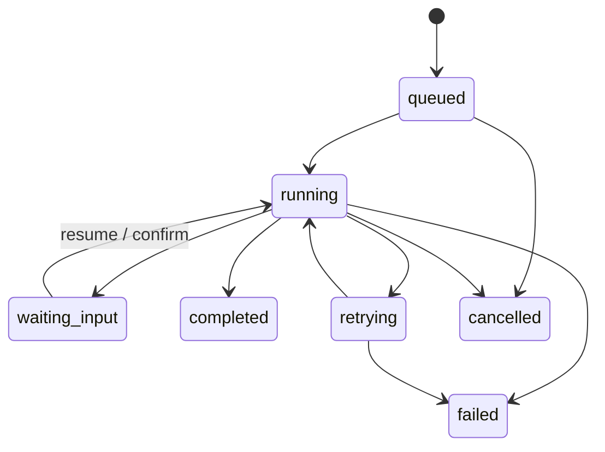

# 任务生命周期

## 状态模型



不同子系统可能使用 `job_id` 或 `task_id`，但应遵循相同语义：状态必须能解释当前发生了什么，不能把失败或等待输入展示成完成。

## 事件

事件用于连接 Runtime、前端和外部客户端。基础字段通常包括类型、运行标识、时间、Worker 和数据。文件结果通过资产引用返回。

```json
{
  "type": "worker.progress",
  "run_id": "run_example",
  "worker": "rvc",
  "timestamp": "2026-09-07T00:00:00Z",
  "data": {"stage": "separate", "percent": 42}
}
```

## 恢复与幂等

- 恢复请求必须绑定原运行或检查点；
- 前端不应通过重新提交相同消息来模拟恢复；
- 完成后的重复确认不能再次产生副作用；
- 取消是明确终态，后续重新执行应创建新任务或按接口规则恢复。

## 前端展示原则

前端只更新当前运行对应的动态区域；状态变化不应导致整页刷新。显示 Worker、阶段、进度、错误和下一步，而不是只显示“处理中”。
