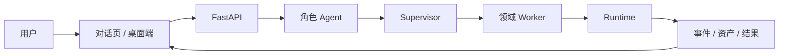

# CHARACTOID 开发者文档

CHARACTOID 是一个本地优先、角色驱动、可恢复执行的 Agent 工作台。它把角色设定、对话、知识检索、文件处理、语音生成、Live2D 表现和外部工具接入放进同一套运行模型。

## 先用起来

| 你想做什么 | 从这里开始 | 你会得到什么 |
| --- | --- | --- |
| 第一次启动 | [快速开始](/guide/quickstart) | 能运行的 Web UI 和健康检查方法 |
| 创建角色 | [创建第一个角色](/guide/character) | 人格、知识、声音和表现层的配置思路 |
| 理解系统 | [系统架构](/concepts/architecture) | Agent、Worker、Runtime 和数据面的关系 |
| 查接口 | [API 总览](/reference/api) | 当前 FastAPI 路由的分组索引 |
| 排查问题 | [问题排查总表](/troubleshooting) | 按现象定位配置、资源和任务问题 |

## 一条完整主线

```text
创建角色
  → 绑定知识、声音与能力
  → 在对话页提出目标
  → Supervisor 选择 Worker
  → Worker 执行可观察任务
  → Runtime 记录状态、事件与资产
  → 结果回到对话，可继续、确认、重试或恢复
```



## 能力地图

- **角色与对话**：角色资料、系统提示词、消息、会话上下文。
- **知识与记忆**：文档摄取、向量检索、重排、引用、长期记忆。
- **文件任务**：附件上传、文档处理、RVC 音频任务和结果资产。
- **声音链路**：ASR、音频标准化、人声分离、GPT-SoVITS、RVC 和 TTS。
- **表现层**：Live2D、口型/动作事件、实时语音流。
- **扩展接入**：Skill、Tool、MCP、B站、OneBot11。
- **工程能力**：评测数据集、运行历史、取消、重试、恢复和资源状态。

## 功能状态怎么读

| 标签 | 含义 |
| --- | --- |
| 稳定 | 当前代码和主要使用路径已经存在，适合按文档使用。 |
| 可选 | 需要额外模型、服务、设备或用户资产。 |
| 实验 | 接口或前端入口已经存在，但仍需按实际环境验证。 |
| 外部依赖 | 需要第三方服务、模型、凭据或独立运行时。 |
| 兼容 | 为旧调用方式保留，不建议新代码继续依赖。 |

> 文档描述当前仓库的真实边界，不承诺所有模型、Provider 或外部平台在每台机器上开箱即用。

## 给不同读者的阅读路径

- **完全小白**：快速开始 → 创建角色 → 第一次任务 → 准备本地资源。
- **想学 Agent**：系统架构 → Agent 与 Worker → 任务生命周期 → 事件与状态。
- **想学 RAG**：RAG 设计 → 知识与评测 API → 配置项。
- **想学音频应用**：语音链路 → 声音与 Live2D 设计 → 语音 API。
- **面试准备**：工程实践与面试材料 → 数据与边界 → API 总览。
