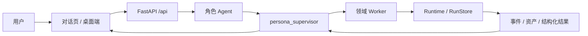

# CHARACTOID 开发者文档

**CHARACTOID 是一个本地优先、角色驱动、可恢复执行的 Agent 工作台。** 它把角色设定、对话、知识检索、文件处理、语音生成、Live2D 表现和外部工具接入放进同一套运行模型，而不是一组互不相干的页面。

> **事实依据**：`app/main.py` → `app/startup/routes.py:register_routes`，`agents/graph/`，`agents/registry.py`，`agents/runtime/`，`app/routers/`。默认 HTTP 入口是 `http://127.0.0.1:18000`，API 前缀为 `/api`。本文描述当前仓库里真实存在的代码路径，不承诺所有模型、Provider 或外部平台在每台机器上开箱即用。

## 先用起来

| 你想做什么 | 从这里开始 | 你会得到什么 |
| --- | --- | --- |
| 第一次启动 | [快速开始](/guide/quickstart) | 能运行的 Web UI 和健康检查方法 |
| 创建角色 | [创建第一个角色](/guide/character) | 人格、知识、声音和表现层的配置思路 |
| 发出一次任务 | [第一次对话任务](/guide/first-task) | Supervisor → Worker → 结果回到对话 |
| 理解系统 | [产品总览](/concepts/overview) 与 [系统架构](/concepts/architecture) | Agent、Worker、Runtime 和数据面的关系 |
| 查接口 | [API 总览](/reference/api) | FastAPI 路由分组和本地约束 |
| 排查问题 | [问题排查总表](/troubleshooting) | 按现象定位配置、资源和任务问题 |

## 一条完整主线

```text
创建角色
  → 绑定知识、声音、形象与能力
  → 在对话页提出目标
  → Supervisor 选择 Worker
  → Worker 执行可观察任务
  → Runtime 记录状态、事件与资产
  → 结果回到同一条对话，可继续、确认、重试或恢复
```



源码上这条链并不是口号：

- 角色与对话入口在 `app/routers/personas.py`、`app/routers/agents.py`、`app/routers/messages.py`。
- 监督者在 `agents/graph/supervisor.py`，图装配在 `agents/graph/build.py`。
- Worker 清单、超时和输出合同在 `agents/registry.py`。
- 运行状态在 `app/run_store.py` 与 `app/routers/runs.py`。
- 健康检查在 `app/startup/routes.py`：`GET /api/health`、`GET /api/status`、`GET /api/launcher/progress`。

## 能力地图

- **角色与对话**：角色资料、系统提示词、消息、会话上下文；流式与可恢复查询见 `/api/personas/{id}/agent/*`。
- **知识与记忆**：文档摄取、向量检索、重排、引用、按角色隔离的记忆。
- **文件任务**：附件上传、文档处理、RVC 会话/任务和结果资产。
- **声音链路**：ASR、音频标准化、人声分离、GPT-SoVITS、RVC、TTS、Voice Studio、实时 PCM 流。
- **表现层**：Live2D 模型发现、VTube Studio 连接信息和口型事件。
- **扩展接入**：Skill、Tool、MCP、OneBot11、B 站等集成路由。
- **工程能力**：评测数据集、运行历史、取消、审批、资源安装任务。

## 功能状态怎么读

| 标签 | 含义 |
| --- | --- |
| 稳定 | 当前代码和主要使用路径已经存在，适合按文档使用。 |
| 可选 | 需要额外模型、服务、设备或用户资产。 |
| 实验 | 接口或前端入口已经存在，但仍需按实际环境验证。 |
| 外部依赖 | 需要第三方服务、模型、凭据或独立运行时。 |
| 兼容 | 为旧调用方式保留，不建议新代码继续依赖。 |

资源双前缀是兼容的例子：`/api/resources` 与 `/api/providers/resources` 同时注册，新代码应使用前者。

## 给不同读者的阅读路径

- **完全小白**：快速开始 → 创建角色 → 第一次任务 → 准备本地资源。
- **想学 Agent**：产品总览 → 系统架构 → Agent 与 Worker → 任务生命周期 → 事件与状态。
- **想学 RAG**：RAG 设计 → 知识与记忆 → 文档/知识 API → 配置项。
- **想学音频应用**：语音链路 → 声音与 Live2D 设计 → 语音 API。
- **要对接口**：API 总览 → 全部路由清单 → 分组参考页。
- **工程实践**：工程实践 → 数据与边界 → 问题排查。

## 文档怎么组织

本站按分层写，接近常见 Agent harness 文档的拆法：

| 层 | 目录 | 写什么 |
| --- | --- | --- |
| 上手 | `guide/` | 能跑起来、能创建角色、能发出第一次任务 |
| 能力 | `capabilities/` | 产品面：对话、知识、文件、语音、Live2D、扩展 |
| 概念 | `concepts/` | 为什么这样设计，源码落在哪 |
| 开发 | `development/` | 如何注册 Worker、扩展 Skill/MCP、维护文档 |
| 参考 | `reference/` | 路由、事件、Worker 合同、配置 |
| 排查 | `troubleshooting/` | 按现象定位，而不是按模块空谈 |

## 本地约束（读任何 API 页之前）

多数写操作和本地资源接口会检查：

1. 请求来自本机；
2. 部分接口要求请求头 `X-CHARACTOID-Request: web`；
3. 浏览器不接收本地绝对路径，只接收 `attachment_id` / `asset_id` / `run_id` / `task_id`。

这些约束来自 `app/routers/settings.py:require_local` 以及各资源路由，不是文档层的额外规定。
